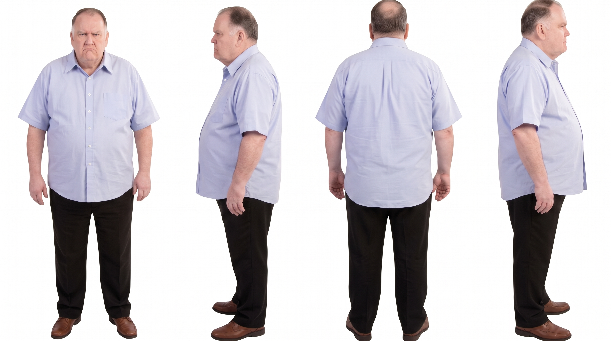
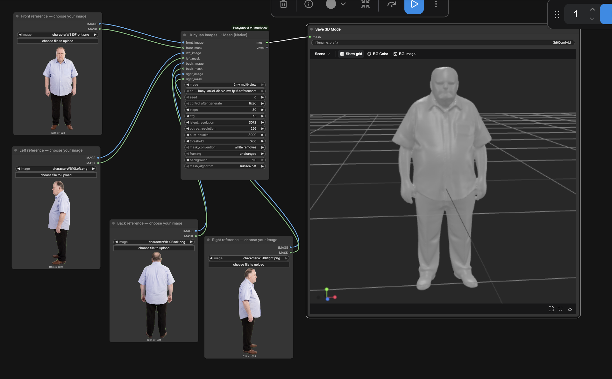
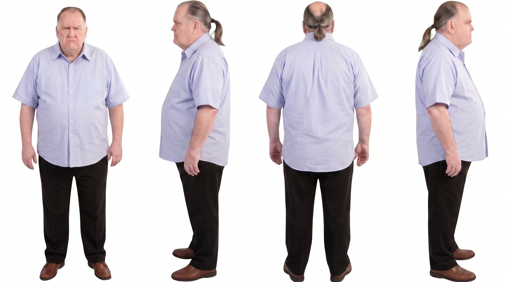
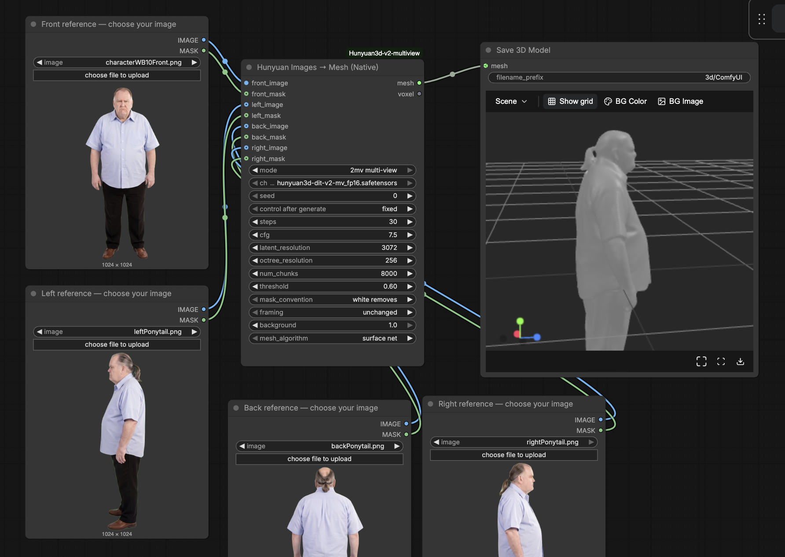
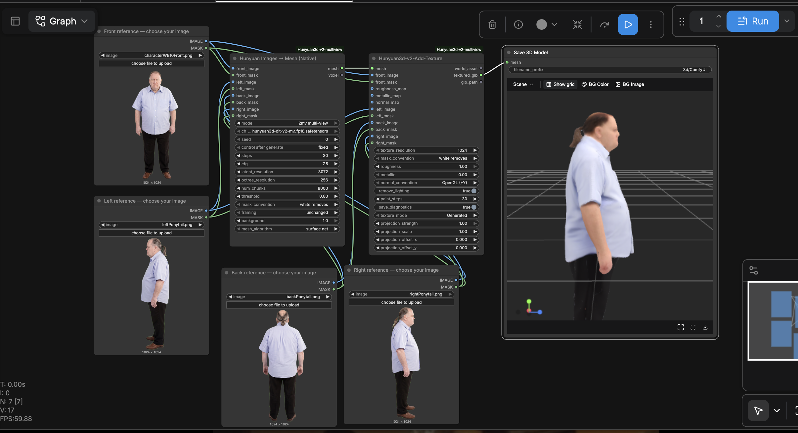
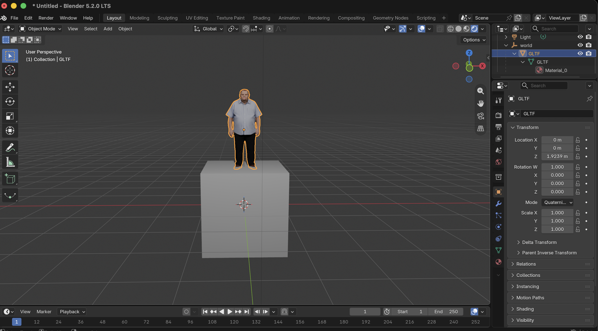
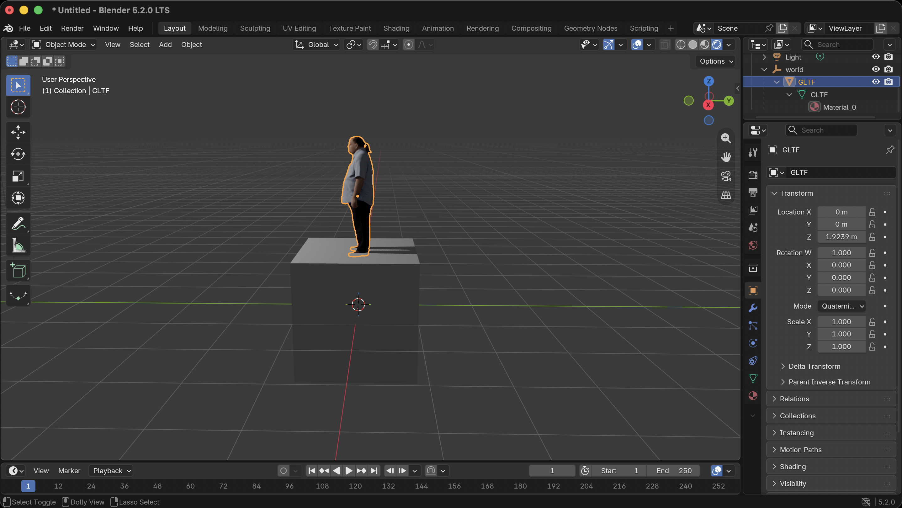

# ComfyUI-Hunyuan3d-v2-multiview

## Video Tutorial

[Set up Hunyuan Multiview and 3D World Interface in ComfyUI on RunPod](https://www.youtube.com/watch?v=DBkhDIWaYBw)

`https://www.youtube.com/watch?v=DBkhDIWaYBw`

## Intro

Create a 3D mesh from up to four images of an object, **front, left, back and right**, using Tencent’s **Hunyuan3D-2mv**, the multiview shape model in the Hunyuan3D 2.0 family. This Custom Node Pack integrates optional texturing, user supplied PBR maps, and GLB export functionality. 

### Multiview Example
The example pose images show a 16:9 character sheet, but you will need to upload 4 seperate 1024x1024 images **without any background**. The front image is required, but the other three views are optional.




### Let's Give Him a Ponytail!



### Add Texture
Use the `Hunyuan3dv2AddTexture` node to add texture.



### Export as a GLB into Blender
Click on the Download Icon in the `Save 3D Model` node and select **GLB**. Simply drag the .glb file into a Blender window and see your 3D model.




 
## Requirements
The Requirements section will be updated with helpful information soon. For now, see [ComfyUI’s official Hunyuan guide](https://docs.comfy.org/tutorials/3d/hunyuan3D-2) and the [checkpoint page](https://huggingface.co/Comfy-Org/hunyuan3D_2.0_repackaged/blob/main/split_files/hunyuan3d-dit-v2-mv_fp16.safetensors).

## Setup

### ComfyUI Desktop Setup

1. Install/update [ComfyUI Desktop](https://www.comfy.org/download). Locate the **user data/install directory chosen during Desktop setup**, containing `custom_nodes` and `models`.
2. Close ComfyUI. 
3. Clone this repository into that directory’s `custom_nodes`, or download the GitHub ZIP and extract it there.
4. Ensure the layout is `custom_nodes/ComfyUI-Hunyuan3d-v2-multiview/__init__.py` in order to avoid an extra nested repository folder.
5. Download the [checkpoint](https://huggingface.co/Comfy-Org/hunyuan3D_2.0_repackaged/resolve/main/split_files/hunyuan3d-dit-v2-mv_fp16.safetensors) into the `models/checkpoints` folder. Always make sure to use the .safetensors file whenever possible for greater security.
6. Restart ComfyUI, load the **mesh-only** workflow below, select your images and checkpoint, and run.

Official references: [custom-node installation support](https://support.comfy.org/articles/9321608144-installing-custom-nodes) and [Desktop repository/path documentation](https://github.com/Comfy-Org/desktop).


### Setup through GitHub (manual ComfyUI / RunPod)

The following commands are for a bash compatible terminal:

```bash
cd /workspace/ComfyUI
cd custom_nodes
git clone https://github.com/defnotkevin/ComfyUI-Hunyuan3d-v2-multiview.git
cd ../models/checkpoints
wget -c 'https://huggingface.co/Comfy-Org/hunyuan3D_2.0_repackaged/resolve/main/split_files/hunyuan3d-dit-v2-mv_fp16.safetensors' -O 'hunyuan3d-dit-v2-mv_fp16.safetensors'
```

If your checkpoints directory does not exist, create it in the `/ComfyUI` directory first with `mkdir -p models/checkpoints`.

Then:

1. Restart ComfyUI and check the startup terminal for import errors
2. Open a ready-made workflow below
3. Choose `2mv multi-view` and `hunyuan3d-dit-v2-mv_fp16.safetensors`
4. Upload your references and run the mesh-only workflow

Note: For texturing, you will need a **CUDA development** environment with `nvcc` and `g++`. A Texture Workflow can take up to **15 minutes**. Backend files default to `ComfyUI/models/hunyuan-texture-backend`.

To update an existing clone:

```bash
cd /workspace/ComfyUI/custom_nodes/ComfyUI-Hunyuan3d-v2-multiview
git pull --ff-only
```

Restart ComfyUI afterward. Keep only one copy of this node pack.

## Ready-made workflows

Download a JSON below (GitHub **Raw / Download raw file**) and drag it into ComfyUI. Replace `front.png`, `left.png`, `back.png`, and `right.png` with your images.

| Workflow | Connections | Output |
|---|---|---|
| [Four views → mesh → Save 3D Model](example_workflows/mesh_four_views_save_glb.json) | Four Load Image nodes → Hunyuan Images → Mesh (Native) → Save 3D Model | Untextured GLB under `ComfyUI/output/3d/` |
| [Four views → textured mesh → Save 3D Model](example_workflows/texture_four_views_save_glb.json) | Same shape inputs → Add Texture, with matching reference images/masks → **textured_glb** → Save 3D Model | Textured GLB under `ComfyUI/output/3d/` |


Optional Scene Assembly: connect `world_asset` to the separately installed [3D World Interface](https://github.com/defnotkevin/ComfyUI-3D-World-Interface). The [four-view World Interface example](example_workflows/texture_four_views_to_world.json) workflow requires that additional pack.

## Node references

All four nodes below are registered by this repository.

| Display name / internal ID | Purpose | Inputs | Outputs |
|---|---|---|---|
| **Hunyuan Images → Mesh (Native)** / `NativeHunyuanImagesToMesh` | Generate geometry using native ComfyUI graph expansion | Front image, optional front mask, left/back/right images and masks, mode, checkpoint, seed, steps, CFG, latent/octree resolution, chunks, threshold, framing, background, mask convention and mesh algorithm | `mesh` (`MESH`), `voxel` (`VOXEL`) |
| **Hunyuan Prepare Image + Mask** / `NativeHunyuanPrepare` | Composite a masked image onto a background and optionally pad it square | `image`, optional `mask`, `mask_convention`, `framing`, `background` | Prepared `IMAGE` |
| **Hunyuan3d-v2-Add-Texture** / `Hunyuan3dv2AddTexture` | UV unwrap and paint one mesh, optional front-reference projection and supplied PBR maps | `mesh`, front image, optional other views/masks, texture resolution, lighting removal, paint steps, diagnostics, material controls and projection controls | `world_asset` (`WORLD_ASSET`), `textured_glb` (`FILE_3D_GLB`), `glb_path` (`STRING`) |
| **Hunyuan3d-v2-Apply-PBR-Maps** / `Hunyuan3dv2ApplyPBRMaps` | Apply supplied material maps to an existing single-mesh World Asset without rerunning neural painting | `world_asset` optional roughness/metallic/normal images, scalar roughness/metallic and normal convention | `world_asset`, `textured_glb`, `glb_path` |

### Important controls and limitations

- **Texture resolution:** The painter generates intermediate views at 512×512 for Hunyuan-3d-2.0 which this workflow is based on.
- **Lighting removal:** optional preprocessing can change reference appearance. Compare diagnostics when likeness changes. `paint_steps` defaults to 30; more steps do not guarantee better likeness.
- **Projection:** `Generated` is the default. Experimental front projection requires a foreground mask and aligns silhouettes, not facial landmarks. Misaligned geometry can produce doubled features. See [REFERENCE-PROJECTION.md](REFERENCE-PROJECTION.md).
- **PBR maps:** Roughness/metallic sliders provide fallback values, but variable roughness, metallic and normal maps need to be supplied by the user.

## Development Credits

Built on [Tencent Hunyuan3D-2](https://github.com/Tencent-Hunyuan/Hunyuan3D-2), [ComfyUI](https://github.com/Comfy-Org/ComfyUI), and [Comfy-Org’s repackaged weights](https://huggingface.co/Comfy-Org/hunyuan3D_2.0_repackaged)
